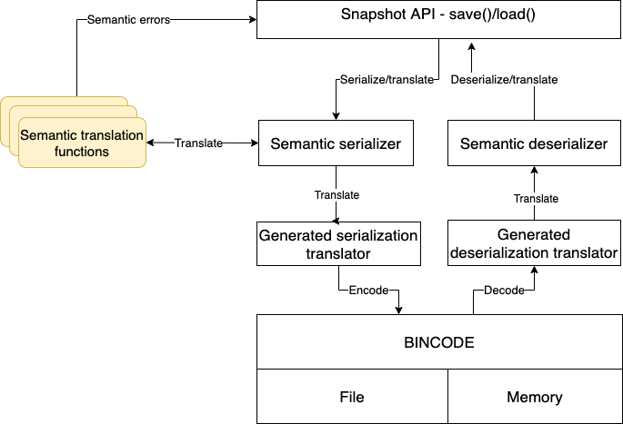
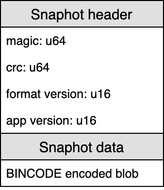
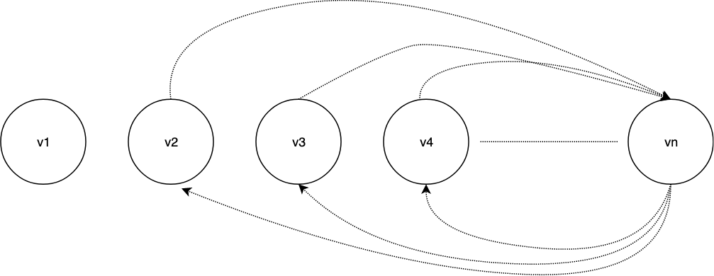

# Snapshot Format

This document provides the base of the design for 
[this PR](https://github.com/firecracker-microvm/firecracker/pull/1644).

## Simplifying assumptions

We are aiming to lower the implementation complexity by making these
assumptions: 
* support only addition and removal of structure fields across versions
* removed structure fields cannot be added again in later versions

## Proposed solution

### Choosing the right storage backend format

During research we have considered multiple storage formats.
The criteria used for comparing these are: performance, size, rust support,
specification, versioning support, community and tooling. Performance, size 
and rust support are hard requirements while all others will be the subject to
trade offs. All options which require external schema definitions are excluded 
because of the rust hard requirement in the sense that we want to keep data 
models defined in the rust modules that use them. 

1. *Serde-bincode*. This is the lowest hanging fruit in terms of performance
   and size. The downside is that it is rust specific and there are no other
   support libraries in any other languages, yet.
1. *Serde-cbor*. [CBOR](https://cbor.io/) is based on the wildly successful
   JSON data model and has an easy to understand
   [RFC](https://tools.ietf.org/html/rfc7049). It combines the strong type 
   definition specific to JSON with a binary format for small snapshot sizes. 
   Compared to bincode it is slower and adds significant size overhead due to 
   metadata describing or naming fields in the serialized data. However, it 
   stands out for tooling and support in different languages (C, C++, Python,
   etc)
1. *MsgPack*. Very similar to CBOR due to the same JSON data model and adds
   overhead to store metadata like field names. It is implemented in as many as
   [50 languages](https://msgpack.org/index.html#languages). 
1. *Custom*: We will fork bincode. 

### Snapshot as a BINCODE blob 

Uses BINCODE as a storage layer to encode/decode a structure containing all the
VMM, vcpu, devices, etc state.
 
The key objectives of this approach are: 

* Minimal snapshot size overhead
* Minimal speed overhead when serializing/deserializing the snapshot
* Lower the effort to implement and maintain by generating version aware 
  serializer and deserializer code
* Provides an interface to implement semantic cross-version translations

### High level components

We define the following components: *Snapshot API*, *Semantic translator*,
*Version aware serializer/deserializer*, *Bincode encoder/decoder*.

#### Snapshot API

Offers support for these usecases: load/save from/to a file; load/save from/to
a memory slice; provides an interface for implementing semantic cross-version
translators.

For an example see 
[this PR](https://github.com/firecracker-microvm/firecracker/pull/1644).

#### Version aware serializer/deserializer 

This component will generate code that performs translations from a source to
a target version. The translations are performed at the field level without 
involving any of the semantics of fields or values. Basically it copies common 
source/target fields. Fields unique to the target version will be serialized/
deserialized with their default values.

It interfaces with the user defined structures and code by using Rust’s 
procedural macros. For each version of the structure it will generate a 
descriptor that aggregates information about field names, types, versioning and 
other annotations. 

Another sub component will handle the processing of the structure descriptors 
and generate code accordingly for serializing and deserializing within a user 
defined version space `[n, n + C]` where `n` is the current version and `C` is 
the number of versions we support translating to/from.

#### Semantic translator

This component acts a second layer of translation focusing on the semantics of 
values stored in the fields previously serialized/deserialized. The implementer
must provide semantic serialization and deserialization functions per field and 
per version.

A semantic serialization function will receive a structure and apply mutations 
in place. The mutated structure is then fed to the next semantic serialization 
function.

The semantic serialization function must be used to perform checks and handle 
corner cases when a certain snapshot cannot be serialized to an older version 
because of a logical or design incompatibility between those 2 versions. 
For example: A newer version of a structure exposes a `queue_size` parameter 
that was previously hardcoded to `128` in older versions of the application. 
The semantic function must check if the current value of the field matches the 
previously application hard-coded value and return an error if it doesn't.

A semantic deserialization function receives a mutable reference to a structure 
and mutates any fields according to user specified logic.  The mutated 
structure will then be passed to the next semantic deserialization function.

#### Bincode encoder/decoder

For serialization/deserialization capabilities we will use the
[serde framework](https://crates.io/crates/serde) and 
[bincode](https://docs.rs/bincode/latest/bincode/) as an encoder/decoder. Serde 
is a framework for serializing and deserializing Rust data structures 
efficiently and generically. The bincode implementation has a very small
footprint.

### High level architecture and flow

## Snapshot storage format

The snapshot is stored in memory or on disk and is structured like this:

The first 8 bytes of the snapshot contain a magic id value that uniquely 
identifies this snapshot format and the architecture (`x86_64`, `aarch64`). 
Loading a snapshot will fail if this id does not match the current arch.

The `crc` field contains a 64 bit checksum of the header and bincode blob. The 
format version refers to the internal structure of the snapshot and how 
primitives (integers, arrays, enums, etc) are encoded. This field is 
incremented each time the internal representation of a snapshots changes and 
allows the format itself to work be serialized/deseriailized across a version 
space.

## Serialization/deserialization translators

All translations will be performed directly from source to target versions as 
defined by the translation graph defined below. 

The translators are version aware and are generated at compile time by a Rust 
derive macro. The code generator will handle only addition and removal of 
fields. It requires the following input: an annotated structure, a version 
translation graph.

The output of the code generator is:

* The structure definition at its latest version - this structure will be used 
  and referenced by the implementers code when using the serialize/deserialize 
  API.
* A translation structure definition which contains all the fields from all 
  versions (even removed fields) - this is used as input and output in semantic 
  translation functions.
* Generated translation code for each edge in the input graph.

The state structures fields must be annotated with version specific 
information, default values and semantic translation functions. Supported field 
annotations:

* `default_fn` = function - the function must return the default field value 
  when serializing to a version that is missing this specific field;
* `start_version` = integer - the version number in which this field was added.
  If not specified, the field defaults to 1.
* `end_version` = integer - the version number in which the field was removed.
* `semantic_ser/de_fn` = function - 2 user defined functions that perform the 
  semantic translations of field values when serializing/deserializing. This 
  augments the generic support for versioned serialization and allows to 
  programmatically mutate any fields during serialization/deserialization using 
  per field and version callbacks into custom code.
  * The deserialization semantic fn receives a reference to the deserialized 
    structure and returns a value of the same type as the annotated field. The 
    generated translator code for deserialization from version `A` to version 
    `B`, `A<B` flows like below:
    * The structure is completely deserialized by using default values and/or 
      `Default` trait implementations.
    * All the specified fns declared in the `(A, B]` version space will be 
      called in the order that they appear and will override the default values 
      from previous step. 
    * The structure is returned to the caller
  * The serialization semantic fn receives a mutable reference to the 
    deserialized structure and updates values in place. The generated 
    translator code for serialization from version `B` to version `A`, `A<B`
    flows like below:
    * A clone of the deserialized structure is created.
    * All the specified fns declared in the `(A, B]` are executed in reverse 
      order
    * The mutated clone is then serialized to the target version using the 
      generated translator code.
* `skip` - Skip serialization deserialization of fields

For an example see 
[this PR](https://github.com/firecracker-microvm/firecracker/pull/1644).

### Serialization

The code generator will emit specific serialization code for each version as in
the graph above. Fields are serialized in the order that they appear in the
structure and this adds the constraint of having the order preserved in the 
deserializer.

When serializing to an older version of the structure, some of the fields that 
have been removed between that version and the current version will be 
serialized using the default specified by annotation. If no default is defined 
then the serializer will fallback to the `Default` trait implementation for 
that field type.

For an example see 
[this PR](https://github.com/firecracker-microvm/firecracker/pull/1644).

### Deserialization

The code generator will emit deserialization code for each version as defined 
in the graph above. Field deserialization order matches the serialization 
order. When deserializing from an older version, the new fields added in the 
current version will be deserialized as the default values specified by the 
annotation. If it is not available the generator will fallback to the `Default`
trait implementation for that specific field.

For an example see 
[this PR](https://github.com/firecracker-microvm/firecracker/pull/1644).

### Version map

Each structure is versioned independently and that implies the definition of a 
mapping between a specific application version and the versions of each 
structure.

There are 2 options here: manually write the version map or generate it. To 
reduce the scope of the implementation we will choose to manually write it. 
